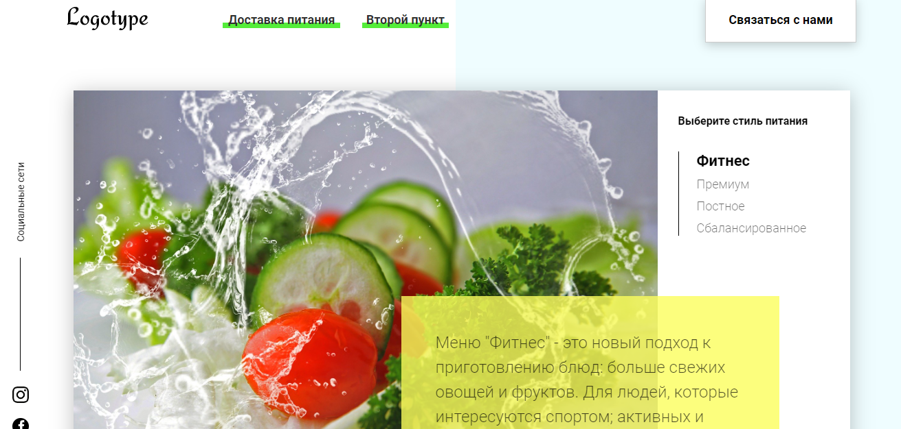
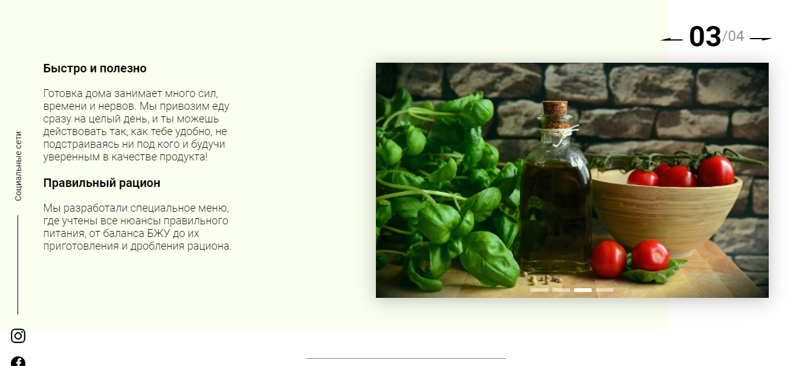

# meal-delivery-service
- project page Meal Delivery Service where you can find and order variety of diets according to your preferences
- website in russian language
 
## General info
My purpose was to make page interactive using only JavaScript. Also I used Webpack as a module bundler.

## Screenshots



## Features
List of features ready and TODOs for future development:
* calorie calculator
* diet filter
* registration form
* tabs
* sliders

To-do list:
* make website responsive

## Status
Project is in progress.

## Setup
To run this project, install it locally using npm:

```
$ npm install
```
